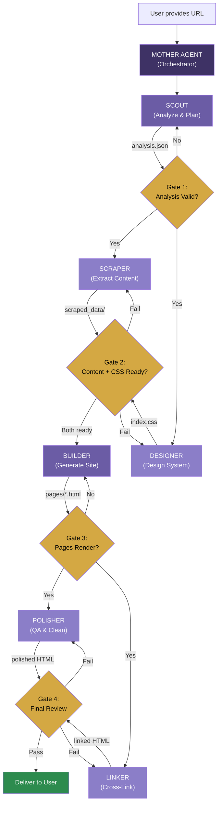
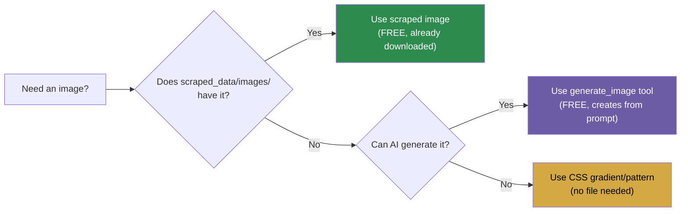

# Website Redesign Agent System — Complete Architecture

> **Purpose**: A fully automated "Mother Agent + Sub-Agent" system that takes any website URL, analyzes it, scrapes all content, and generates a completely redesigned modern website — without manual intervention.

---

## Table of Contents
1. [System Overview](#system-overview)
2. [Complete Process Walkthrough (What We Did)](#process-walkthrough)
3. [Agent Architecture](#agent-architecture)
4. [Sub-Agent Definitions](#sub-agent-definitions)
5. [Workflow Files (Ready to Use)](#workflow-files)
6. [Tool & Skill Reference](#tool-reference)
7. [Cost Controls](#cost-controls)
8. [Error Handling & Validation](#error-handling)

---

## System Overview



### Key Principles
- **Parallel execution** — Sub-agents run concurrently wherever dependencies allow
- **4 validation gates** — Mother Agent validates before opening the next lane
- **Lane 1** (after Scout): Scraper + Designer run **at the same time**
- **Lane 2** (after Builder): Polisher + Linker run **at the same time**
- **Apify** is used ONLY for actor discovery (low credit cost), NOT for full scraping
- **Python scraper** (`content_scraper.py`) does all heavy data extraction
- **UI/UX Pro Max Skill** drives the design system
- **Budget-safe**: Apify calls capped at `maxItems: 5`

### Parallel Execution Timeline

```
Time ─────────────────────────────────────────────►

[SCOUT]─────► GATE1 ─┬─[SCRAPER]──────► GATE2 ─►[BUILDER]──► GATE3 ─┬─[POLISHER]──► GATE4 ──► DONE
                      │                   ▲                          │               ▲
                      └─[DESIGNER]────────┘                          └─[LINKER]──────┘

                      ◄─── PARALLEL ───►                             ◄── PARALLEL ──►
```

---

## Process Walkthrough

> This is exactly what we did for Joyful Heart + JesusWalk, documented step-by-step.

### Phase 1: Discovery & Planning
| Step | What Happened | Tool Used | Files Created |
|:-----|:-------------|:----------|:-------------|
| 1.1 | User provided the original website URL (`joyfulheart.com`) | — | — |
| 1.2 | Browsed the live site to understand its purpose, structure, navigation | `browser_subagent` | Screenshots |
| 1.3 | Identified it as a Christian Bible study ministry with 200+ pages | `browser_subagent` | — |
| 1.4 | Discovered linked site `jesuswalk.com` that needed same treatment | `browser_subagent` | — |
| 1.5 | Used Apify MCP to discover useful scraping actors | `list_resources` (Apify MCP) | — |
| 1.6 | Created audit & plan document | `write_to_file` | [joyful_heart_audit_and_redesign.md](file:///C:/Users/ADMIN/.gemini/antigravity/brain/60b9bad4-d9d7-43e7-88d3-e02603381be3/joyful_heart_audit_and_redesign.md) |

### Phase 2: Content Scraping
| Step | What Happened | Tool Used | Files Created |
|:-----|:-------------|:----------|:-------------|
| 2.1 | Analyzed the existing `website-analyzer-poc` project for scraping patterns | `view_file`, `view_file_outline` | — |
| 2.2 | Built a custom Python BFS web crawler | `write_to_file` | [content_scraper.py](file:///c:/Users/ADMIN/Desktop/J_project/Automated%20website%20develop/joyful-heart-redesign/scraper/content_scraper.py) |
| 2.3 | Scraper extracts: title, headings, paragraphs, images, links, lists, meta tags | `run_command` | `scraped_data/pages/*.json`, `scraped_data/images/*` |
| 2.4 | Crawled `joyfulheart.com` (200+ pages) and `jesuswalk.com` (58+ pages) | `run_command` | 244 JSON files + images |
| 2.5 | Generated sitemap and summary files | Scraper auto-generates | `scraped_data/sitemap.json`, `scraped_data/summary.txt` |

### Phase 3: Design System Generation
| Step | What Happened | Tool Used | Files Created |
|:-----|:-------------|:----------|:-------------|
| 3.1 | Used UI/UX Pro Max Skill to generate design system | `run_command` (search.py) | Design tokens |
| 3.2 | Chose color palette: deep purple primary (#3E3265), warm gold secondary | Skill output | — |
| 3.3 | Chose typography: Cormorant Garamond (headings) + Inter (body) | Skill output | — |
| 3.4 | Created base CSS with all design tokens, animations, responsive grid | `write_to_file` | [index.css](file:///c:/Users/ADMIN/Desktop/J_project/Automated%20website%20develop/joyful-heart-redesign/index.css) (1099 lines) |

### Phase 4: Page Generation
| Step | What Happened | Tool Used | Files Created |
|:-----|:-------------|:----------|:-------------|
| 4.1 | Built the `PageGenerator` class with 15 page type generators | `write_to_file` | [page_generator.py](file:///c:/Users/ADMIN/Desktop/J_project/Automated%20website%20develop/joyful-heart-redesign/scraper/page_generator.py) (1011 lines) |
| 4.2 | Content cleaning engine: filters nav text, boilerplate, endnotes | Built into generator | — |
| 4.3 | Generated all pages: homepage, about, articles, bible-studies, books, podcast, FAQ, contact, giving, newsletter, 200+ article pages | `run_command` | `pages/*.html`, `index.html` |
| 4.4 | Same process for JesusWalk with adapted generator | `write_to_file` | [jw_page_generator.py](file:///c:/Users/ADMIN/Desktop/J_project/Automated%20website%20develop/jesuswalk-redesign/scraper/jw_page_generator.py) |

### Phase 5: Cross-Linking & Polish
| Step | What Happened | Tool Used | Files Created |
|:-----|:-------------|:----------|:-------------|
| 5.1 | Built URL map: 120 original URLs → local redesign page paths | `write_to_file`, `run_command` | [build_url_map.py](file:///c:/Users/ADMIN/Desktop/J_project/Automated%20website%20develop/jesuswalk-redesign/scraper/build_url_map.py) |
| 5.2 | Patched bible-studies.html: 58 external links → local links | `run_command` | [fix_bible_links_direct.py](file:///c:/Users/ADMIN/Desktop/J_project/Automated%20website%20develop/jesuswalk-redesign/scraper/fix_bible_links_direct.py) |
| 5.3 | Added sticky section jump bar + live search to All Studies | `run_command` | [upgrade_all_studies.py](file:///c:/Users/ADMIN/Desktop/J_project/Automated%20website%20develop/jesuswalk-redesign/scraper/upgrade_all_studies.py) |
| 5.4 | Polished 90+ messy titles/descriptions across both sites | `run_command` | [polish_titles.py](file:///c:/Users/ADMIN/Desktop/J_project/Automated%20website%20develop/jesuswalk-redesign/scraper/polish_titles.py) |
| 5.5 | Verified everything via browser and script checks | `browser_subagent`, `run_command` | Screenshots |

---

## Agent Architecture

### Mother Agent Prompt

```
You are the WEBSITE REDESIGN ORCHESTRATOR. You oversee 6 specialized sub-agents
to fully redesign any website from a given URL.

INPUT: A website URL from the user.
OUTPUT: A complete, beautiful, modern redesigned website with all pages generated,
        all links working, and all content preserved.

YOUR ROLE — PARALLEL ORCHESTRATION:
1. Start SCOUT sub-agent → wait for analysis.json
2. GATE 1: Validate analysis. If pass → launch SCRAPER + DESIGNER IN PARALLEL
3. GATE 2: Wait for BOTH to finish. Validate scraped data AND CSS. If both pass → launch BUILDER
4. GATE 3: Validate generated pages render correctly. If pass → launch POLISHER + LINKER IN PARALLEL
5. GATE 4: Wait for BOTH to finish. Final validation. If pass → deliver to user
6. If ANY gate fails → send the failing sub-agent back with specific feedback, re-run only that agent

PARALLEL RULES:
- SCRAPER + DESIGNER have NO dependency on each other → run simultaneously
- POLISHER + LINKER have NO dependency on each other → run simultaneously
- BUILDER depends on BOTH Scraper output + Designer CSS → waits at Gate 2
- Use parallel tool calls wherever possible to maximize speed

VALIDATION GATES:
- GATE 1 (after SCOUT):    analysis has purpose, page_types, navigation, estimated pages
- GATE 2 (after SCRAPER+DESIGNER): JSON count >= 80% estimate AND CSS has all tokens
- GATE 3 (after BUILDER):  homepage renders, nav works, images load (browser check)
- GATE 4 (after POLISHER+LINKER): zero text artifacts, zero missed local links

BUDGET RULES:
- Apify MCP: ONLY for actor discovery. maxItems: 5, maxCrawlPages: 3
- Full scraping: ALWAYS use content_scraper.py (free, local Python)
- If Apify fails or budget is exhausted, SCRAPER falls back to content_scraper.py

CRITICAL FILES (already built, reuse these):
- Scraper engine:  joyful-heart-redesign/scraper/content_scraper.py
- Page generator:  joyful-heart-redesign/scraper/page_generator.py
- JW generator:    jesuswalk-redesign/scraper/jw_page_generator.py
- Design CSS base: joyful-heart-redesign/index.css
- UI/UX Skill:     c:\Users\ADMIN\.agents\skills\ui-ux-pro-max-skill\SKILL.md
```

---

## Sub-Agent Definitions

### Sub-Agent 1: SCOUT (Analyze & Plan)

**Purpose**: Browse the target website, understand its purpose, map all pages, identify linked sites.

**Prompt**:
```
ROLE: Website Scout & Analyst
INPUT: A URL to analyze
OUTPUT: A JSON analysis file with the following structure:

{
  "url": "<target URL>",
  "purpose": "<1-sentence description of the website's purpose>",
  "organization": "<name of organization/brand>",
  "industry": "<education|ministry|ecommerce|portfolio|saas|etc>",
  "page_types": ["homepage", "article", "about", "contact", ...],
  "total_estimated_pages": <number>,
  "navigation_structure": ["Home", "About", "Articles", ...],
  "linked_sites": ["<any sister/companion sites>"],
  "key_people": ["<names of key people featured>"],
  "key_images": ["<descriptions of important images like logos, portraits>"],
  "design_keywords": "<3-5 adjectives describing the desired design style>",
  "has_blog": true/false,
  "has_ecommerce": true/false,
  "color_mood": "<warm|cool|neutral|vibrant>"
}

STEPS:
1. Navigate to the URL using browser_subagent
2. Take screenshots of: homepage, navigation menu, about page, a sample inner page
3. Read the page DOM to extract navigation links
4. Count approximate total pages from sitemap or nav
5. Identify any companion/sister sites linked in the footer or nav
6. Determine the site's purpose and industry
7. Output the analysis JSON

TOOLS: browser_subagent, read_url_content, view_file
MCP (optional): Google AI Studio → use `generate_content` to analyze scraped HTML
  and produce a structured summary of the site's purpose, audience, and tone.
  This gives deeper insight than just browsing.
```

**Validation criteria**: Must have all JSON fields populated. `purpose` must be a real sentence, not empty. `page_types` must have 3+ entries.

---

### Sub-Agent 2: SCRAPER (Extract Content)

**Purpose**: Scrape all pages from the website using the Python engine. Falls back gracefully if any tool fails.

**Prompt**:
```
ROLE: Content Extraction Engine
INPUT: The SCOUT analysis JSON + the target URL
OUTPUT: A directory of scraped JSON files (one per page) + downloaded images

STEPS:
1. Create a project directory: <project-name>-redesign/
2. Copy content_scraper.py to <project>/scraper/
3. Configure the scraper:
   - start_urls = [target URL]
   - max_pages = 300 (adjustable based on SCOUT estimate)
   - allowed_domains = [target domain + any sister sites from SCOUT]
4. Run the scraper: python content_scraper.py
5. Verify output:
   - Count JSON files in scraped_data/pages/
   - Verify each has: url, title, paragraphs (non-empty)
   - Verify images downloaded to scraped_data/images/
6. If any pages are missing, add them to start_urls and re-run

FALLBACK (if website blocks requests):
- Use Apify MCP: call the web-scraper actor with maxCrawlPages: 3
  to get the sitemap/structure only
- Then use read_url_content tool to fetch individual pages
- Parse the HTML manually with BeautifulSoup

CRITICAL: content_scraper.py is the PRIMARY tool. Apify is SECONDARY.
          Never use Apify for full content extraction.

OUTPUT FILES:
  scraped_data/
    pages/       ← JSON files, one per page
    images/      ← Downloaded images
    sitemap.json ← URL → filename map
    summary.txt  ← Scrape statistics

TOOLS: run_command (python), write_to_file, read_url_content (fallback)
APIFY MCP: ONLY if scraper fails. maxItems: 5, maxCrawlPages: 3
```

**Validation criteria**: JSON file count must be >= 80% of SCOUT's estimated page count. Each JSON must have non-empty `title` and at least 1 paragraph.

---

### Sub-Agent 3: DESIGNER (Design System)

**Purpose**: Generate a complete design system (colors, fonts, spacing, animations) using the UI/UX Pro Max Skill.

**Prompt**:
```
ROLE: Design System Generator
INPUT: SCOUT analysis (industry, purpose, design_keywords, color_mood)
OUTPUT: A complete index.css file with all design tokens

STEPS:
1. Read the UI/UX Pro Max Skill:
   view_file c:\Users\ADMIN\.agents\skills\ui-ux-pro-max-skill\SKILL.md

2. Run the design system search:
   python c:\Users\ADMIN\.agents\skills\ui-ux-pro-max-skill\src\ui-ux-pro-max\scripts\search.py
     "<industry> <purpose_keywords> <design_keywords>" --design-system -p "<Project Name>"

3. Extract from the output:
   - UI pattern (hero, cards, grid, etc.)
   - Color palette (primary, secondary, accent, backgrounds)
   - Typography (heading font, body font, from Google Fonts)
   - Effects (glassmorphism, gradients, shadows, micro-animations)

4. Create index.css with:
   - CSS custom properties (--color-primary, --color-secondary, --bg-surface, etc.)
   - Typography system (font-family, sizes, weights, line-heights)
   - Layout system (.container, .section, grids)
   - Component styles (.btn, .study-card, .hero, .navbar, .footer)
   - Animation system (@keyframes, .animate-in, scroll triggers)
   - Responsive breakpoints (375px, 768px, 1024px, 1440px)
   - Dark mode support (if appropriate)
   - Smooth scroll (scroll-behavior: smooth)

5. Verify contrast ratios: primary text on backgrounds must be 4.5:1+

ANTI-PATTERNS TO AVOID:
- No generic colors (plain red, blue, green)
- No browser-default fonts
- No utility-class frameworks unless user requests
- No inline styles (everything in CSS variables)

TOOLS: run_command (python search.py), write_to_file
SKILL: c:\Users\ADMIN\.agents\skills\ui-ux-pro-max-skill\SKILL.md
MCP (optional): Stitch MCP → if a Stitch project exists for this site or industry,
  use `get_screen_code` to extract Design DNA (fonts, colors, layouts) as a reference.
  This supplements the UI/UX Skill output with production-tested patterns.
```

**Validation criteria**: CSS must define at minimum: `--color-primary`, `--color-secondary`, `--bg-surface`, `--font-heading`, `--font-body`. Must include `.container`, `.hero`, `.btn`, `.navbar`, `.footer` classes.

---

### Sub-Agent 4: BUILDER (Generate Site)

**Purpose**: Generate all HTML pages from scraped data using the page generator.

**Prompt**:
```
ROLE: HTML Page Generator
INPUT: Scraped JSON data + Design CSS + SCOUT analysis
OUTPUT: A complete website with all pages generated

STEPS:
1. Adapt page_generator.py for this specific site:
   - Update navigation links based on SCOUT's nav structure
   - Update footer with correct organization name
   - Update brand name and tagline
   - Configure page types to match SCOUT's page_types list

2. Generate specialized pages based on site type:
   ALWAYS generate:
     - index.html (homepage with hero, features, CTA)
     - about.html
     - contact.html

   IF site has articles/blog:
     - articles.html (index page with cards)
     - Individual article pages from JSON data

   IF site has studies/courses:
     - studies.html or catalog.html with section grouping

   IF site has e-commerce:
     - products.html with grid layout

3. Content cleaning rules (built into generator):
   - Filter nav text from paragraphs (NAV_PATTERNS list)
   - Filter boilerplate signup prompts  
   - Collapse double spaces
   - Fix HTML entities (&#x27; → ')
   - Clean up titles (remove prefixes, ".Spanish version.", etc.)

4. IMAGE HANDLING (follow this priority chain):

   PRIORITY 1 — Scraped images (from content_scraper.py):
   - The SCRAPER sub-agent downloads ALL images from the original site
   - These live in: scraped_data/images/
   - Use these FIRST for: logos, portraits, article images, product photos
   - Reference them with relative paths: ../scraped_data/images/filename.jpg

   PRIORITY 2 — AI-generated images (generate_image tool):
   - Use the built-in `generate_image` tool to CREATE new images when:
     a. The original site had no hero background → generate one
        Example prompt: "serene golden sunrise over open Bible, warm tones, no text"
     b. Scraped images are too small/low quality → generate a replacement
     c. A section needs an illustration that didn't exist before
     d. Placeholder images needed for missing content
   - This tool is FREE and unlimited — use it generously
   - Save generated images to: images/ in the project root

   PRIORITY 3 — CSS-only visuals (no image file needed):
   - Hero backgrounds can use CSS gradients instead of images
   - Decorative elements use CSS (borders, shadows, pseudo-elements)
   - Section dividers use SVG patterns or CSS shapes

   NEVER: Leave broken image references or empty  tags

5. Homepage sections to include:
   - Hero with gradient background OR generated hero image + CTA buttons
   - Featured content cards (3-6 items)
   - "How it works" or "About" teaser
   - Testimonials or key quotes
   - Full-width CTA banner
   - Footer with links and copyright

6. Run the generator:
   python page_generator.py

7. Start a local server to verify:
   python -m http.server 8080

8. Use browser_subagent to take verification screenshots

TOOLS: write_to_file, run_command, browser_subagent, generate_image
MCP (optional): Stitch MCP → use `build_site` to generate production-ready HTML
  for complex pages (e.g. landing pages, dashboards). Feed it the design tokens
  from the DESIGNER phase + content from SCRAPER. Use output as a starting template.
MCP (optional): Google AI Studio → use `generate_content` to rewrite/improve
  scraped copy that is poorly written, too short, or needs SEO optimization.
```

**Validation criteria**: Every JSON file must produce an HTML file. Homepage must render without errors in browser. Navigation links must all resolve. No broken image references.

---

### Sub-Agent 5: POLISHER (QA & Clean Up)

**Purpose**: Quality-check all generated pages, fix titles, descriptions, and visual issues.

**Prompt**:
```
ROLE: Quality Assurance & Polish
INPUT: Generated HTML files
OUTPUT: Polished HTML files with clean text and verified rendering

CHECKS TO PERFORM:
1. TEXT QUALITY (automated script):
   - Find all <h3> tags with double spaces → fix
   - Find all <p> tags with broken parentheses "(text)(text)" → fix
   - Find all ".Spanish version." artifacts → remove
   - Find all "JesusWalk:" prefixes in non-JesusWalk sites → remove
   - Fix HTML entities: &#x27; → ', &amp; → & (in display text only)
   - Collapse "and" → "&" in title pairs ("Names and Titles" → "Names & Titles")
   - Truncate titles longer than 60 characters

2. VISUAL QUALITY (browser verification):
   - Screenshot homepage at 1920px, 768px, 375px widths
   - Verify hero section has proper gradient/background
   - Verify cards have consistent heights
   - Verify no text overflow or clipping
   - Verify footer is visible at page bottom
   - Verify navigation is functional

3. ACCESSIBILITY:
   - All images have alt text
   - All links have descriptive text (no "click here")
   - Color contrast passes 4.5:1

4. If ANY check fails:
   - Create a fix script (Python) that patches the HTML directly
   - Run the fix script
   - Re-verify
   - Loop until all checks pass

TOOLS: run_command, browser_subagent, write_to_file (for fix scripts)
MCP (optional): Google AI Studio → use `generate_content` to:
  - Rewrite awkward/broken sentences found during QA
  - Generate better meta descriptions for SEO
  - Improve alt text on images that have generic descriptions
```

**Validation criteria**: Zero double-spaces in any `<h3>` or `<p>`. Zero broken parentheses. All screenshots render correctly at 3 viewports. No 404 images.

---

### Sub-Agent 6: LINKER (Cross-Link & Integration)

**Purpose**: Update all internal links, add search/filter features, prepare for deployment.

**Prompt**:
```
ROLE: Cross-Linker & Integration Specialist
INPUT: Generated sites (may be multiple related sites)
OUTPUT: Sites with all internal links resolved and enhanced navigation

STEPS:
1. BUILD URL MAP:
   - Scan all scraped JSON files for original URLs
   - Map each original URL to its corresponding generated HTML filename
   - Handle edge cases: URLs with/without trailing slashes, alternate domains

2. PATCH LINKS:
   - For each generated HTML file:
     a. Find all <a href="https://original-site.com/..."> links
     b. Look up in URL map
     c. Replace with relative local path (../../other-site/pages/file.html)
     d. Remove target="_blank" for local links
     e. Update link label: "Visit External" → "Start Study →" (or equivalent)

3. ADD ENHANCED NAVIGATION (if site has 10+ items in a category):
   - Sticky section jump bar with pills for each category
   - Live search/filter input
   - Section anchor IDs with scroll-offset for sticky nav
   - Active pill highlighting on scroll
   - "No results" fallback message

4. VERIFY ALL LINKS:
   - Script to extract every href from every HTML file
   - Check that local links resolve to existing files
   - Report any remaining external links (intentional vs missed)
   - Count: should be 0 missed external links

5. CTA UPDATES:
   - Homepage CTAs point to correct internal pages
   - "Visit external" buttons updated to "Browse [Site Name]"

TOOLS: write_to_file, run_command, grep_search (to find link patterns)
```

**Validation criteria**: Zero external links that have local equivalents. All `<a href>` values that start with `../../` must resolve to existing files. Search/filter must work (verified via browser).

---

## Image Strategy

The system has **two image sources** — use them in priority order:



| Source | What It Is | Cost | When to Use |
|:-------|:-----------|:-----|:------------|
| **Scraped images** | Photos/logos downloaded by `content_scraper.py` | Free | Logos, portraits, article images, product photos |
| **`generate_image` tool** | AI image generator (built-in) — creates images from text prompts | Free | Hero backgrounds, missing illustrations, themed placeholders, section art |
| **CSS-only visuals** | Gradients, shadows, SVG patterns | Free | Hero backgrounds (alternative), decorative dividers, section accents |

### Example `generate_image` Prompts

| Scenario | Prompt |
|:---------|:-------|
| Ministry hero background | `"serene golden sunrise over an open Bible on a wooden desk, warm tones, soft focus, no text"` |
| E-commerce hero | `"modern flat-lay of premium products on marble surface, clean minimal aesthetic, soft shadows"` |
| Portfolio hero | `"abstract geometric pattern, dark purple and gold, modern luxury feel, no text"` |
| Missing author portrait | `"professional headshot placeholder, neutral grey background, silhouette style"` |
| Section illustration | `"watercolor illustration of people studying together, warm earth tones, minimal detail"` |

> [!TIP]
> The `generate_image` tool is **free and unlimited**. Use it generously to fill gaps and elevate the design beyond what the original site had.

---

## Workflow Files

These should be saved as `.md` files in `c:\Users\ADMIN\.agents\workflows\`

### Main Workflow: `/redesign`

Save to: `c:\Users\ADMIN\.agents\workflows\redesign.md`

```yaml
---
description: Fully automated website redesign from URL
---

# Website Redesign Workflow

## Input
User provides: A website URL to redesign

## Phase 1: SCOUT (solo)
// turbo
1. Read the target URL with `read_url_content`
2. Browse the site with `browser_subagent` — screenshot homepage, nav, about, inner page
3. Generate analysis JSON: purpose, industry, page_types, navigation, estimated pages, linked sites
4. GATE 1: Validate analysis has all fields. If fail → re-run with deeper browsing

## Phase 2: SCRAPER + DESIGNER (parallel)
// turbo
// turbo-all
// Run these TWO blocks at the SAME TIME — they have no dependency on each other

### 2A: SCRAPER (runs in parallel with 2B)
5. Copy `content_scraper.py` to new project directory
6. Configure scraper with target URL + allowed domains from SCOUT
7. Run scraper: `python content_scraper.py`
8. Count JSON files vs estimated pages

### 2B: DESIGNER (runs in parallel with 2A)
9. Read UI/UX Pro Max Skill: `view_file SKILL.md`
10. Run design system search: `python search.py "<industry> <keywords>" --design-system`
11. Generate `index.css` with full design token system

### GATE 2: Wait for BOTH to finish
12. Validate: JSON count >= 80% AND CSS has all required tokens
13. If SCRAPER fails → re-run scraper with added URLs (DESIGNER result preserved)
14. If DESIGNER fails → re-run design search (scraper result preserved)
15. Only proceed when BOTH pass

## Phase 3: BUILDER (solo — needs both scraper data + CSS)
// turbo
16. Adapt `page_generator.py` for this site structure
17. Update nav, footer, brand from SCOUT analysis
18. Run generator: `python page_generator.py`
19. Start local server: `python -m http.server 8080`
20. GATE 3: Browser verify homepage renders, nav works, images load. If fail → fix and re-run

## Phase 4: POLISHER + LINKER (parallel)
// turbo
// turbo-all
// Run these TWO blocks at the SAME TIME — they operate on different concerns

### 4A: POLISHER (runs in parallel with 4B)
21. Run text quality script (double spaces, broken parens, entities)
22. Take responsive screenshots at 1920px, 768px, 375px

### 4B: LINKER (runs in parallel with 4A)
23. Build URL map from scraped data
24. Patch all internal links (external → local)
25. Add search/filter UI if site has 10+ items in a category

### GATE 4: Wait for BOTH to finish
26. Validate: zero text artifacts AND zero missed local links
27. If POLISHER fails → run fix script, re-verify (linker result preserved)
28. If LINKER fails → add missing URL map entries, re-patch (polisher result preserved)
29. Only deliver to user when BOTH pass
```

---

## Tool Reference

| Tool | When to Use | Budget Impact |
|:-----|:------------|:-------------|
| `browser_subagent` | Visual verification, screenshots, interaction testing | Free |
| `read_url_content` | Fetch page HTML without JavaScript | Free |
| `run_command` (Python) | Scraping, generation, fixing, verification | Free |
| `write_to_file` | Create/modify scripts and HTML | Free |
| `generate_image` | Create placeholder images or hero backgrounds | Free |
| `grep_search` | Find patterns across files | Free |
| **Apify MCP** | **ONLY actor discovery** — `maxItems: 5` | **$0.01–0.05/call** |
| **Google AI Studio MCP** | Content analysis, copy rewriting, SEO meta, PDF→Markdown | Free (uses Gemini API key) |
| **Stitch MCP** | Design DNA extraction, production HTML generation from Stitch projects | Free (uses Stitch API key) |
| **UI/UX Skill** | Design system generation | Free (local Python) |

### Apify Budget Rules

```
HARD LIMITS:
  maxItems: 5          ← never exceed
  maxCrawlPages: 3     ← never exceed  
  timeout: 30          ← in seconds

USE ONLY FOR:
  ✅ Finding what actors exist for a domain
  ✅ Getting sitemap structure (3 pages max)
  ✅ Checking if a site is JS-rendered (determines scraper strategy)

NEVER USE FOR:
  ❌ Full content extraction (use content_scraper.py)
  ❌ Image downloading (scraper handles this)
  ❌ Link crawling (scraper's BFS handles this)
```

---

## Cost Controls

| Resource | Budget | Actual Usage |
|:---------|:-------|:-------------|
| Apify credits | $1.00 max | ~$0.05 per redesign |
| API calls | 0 | content_scraper.py is local |
| Image assets | 0 | Downloaded from original site |
| External services | 0 | Everything runs locally |
| Local compute | Free | Python scripts + http.server |

---

## Error Handling

| Error | Fallback Strategy |
|:------|:------------------|
| Apify fails / out of credits | Skip Apify entirely. Use `read_url_content` + `content_scraper.py` |
| Website blocks scraper (403) | Add random delays (1-3s), rotate User-Agent, retry 2x |
| Site is JavaScript-rendered | Use `browser_subagent` to render pages, extract DOM text |
| Scraped images missing/broken | Use `generate_image` tool with themed prompt to create replacements |
| Hero image doesn't exist | Generate with `generate_image` OR use CSS gradient as fallback |
| Images too low quality | Generate higher-quality AI replacement with descriptive prompt |
| Generator crashes on a page | Skip that page, log it, continue. Fix manually after |
| Link map has gaps | External fallback: keep original URL with `target="_blank"` |
| CSS contrast fails | Auto-adjust: lighten/darken colors by 10% and re-check |

---

## Key Files Reference

### Core Engine (Reusable)

| File | Purpose | Lines |
|:-----|:--------|:------|
| [content_scraper.py](file:///c:/Users/ADMIN/Desktop/J_project/Automated%20website%20develop/joyful-heart-redesign/scraper/content_scraper.py) | BFS web crawler + image downloader | 495 |
| [page_generator.py](file:///c:/Users/ADMIN/Desktop/J_project/Automated%20website%20develop/joyful-heart-redesign/scraper/page_generator.py) | HTML generator with 15 page types | 1011 |
| [index.css](file:///c:/Users/ADMIN/Desktop/J_project/Automated%20website%20develop/joyful-heart-redesign/index.css) | Design system CSS template | 1099 |

### Utility Scripts (Reusable)

| File | Purpose |
|:-----|:--------|
| [polish_titles.py](file:///c:/Users/ADMIN/Desktop/J_project/Automated%20website%20develop/jesuswalk-redesign/scraper/polish_titles.py) | Clean up messy scraped titles/descriptions |
| [upgrade_all_studies.py](file:///c:/Users/ADMIN/Desktop/J_project/Automated%20website%20develop/jesuswalk-redesign/scraper/upgrade_all_studies.py) | Add search bar + section jump pills |
| [fix_bible_links_direct.py](file:///c:/Users/ADMIN/Desktop/J_project/Automated%20website%20develop/jesuswalk-redesign/scraper/fix_bible_links_direct.py) | Patch external links → local links |
| [build_url_map.py](file:///c:/Users/ADMIN/Desktop/J_project/Automated%20website%20develop/jesuswalk-redesign/scraper/build_url_map.py) | Generate URL → filename mapping |

### MCP Servers Available

| Server | Purpose | Tools Available | When to Use |
|:-------|:--------|:---------------|:------------|
| **Apify** | Actor discovery, light scraping | `list_actors`, `run_actor` | SCOUT: discover scraping actors. SCRAPER: fallback if Python scraper fails |
| **Google AI Studio** | Content analysis, copy improvement, PDF→MD | `generate_content`, `convert_pdf_to_markdown` | SCOUT: deep site analysis. BUILDER: rewrite poor copy. POLISHER: SEO meta, alt text |
| **Stitch** | Design DNA extraction, production HTML | `build_site`, `get_screen_code`, `get_screen_image` | DESIGNER: extract design patterns. BUILDER: generate production landing pages |

### Skills Available

| Skill | Purpose | Path |
|:------|:--------|:-----|
| **UI/UX Pro Max** | Design system generation | `c:\Users\ADMIN\.agents\skills\ui-ux-pro-max-skill\SKILL.md` |
| **Remotion Best Practices** | Video generation (if needed) | `c:\Users\ADMIN\.agents\skills\remotion-best-practices\SKILL.md` |
